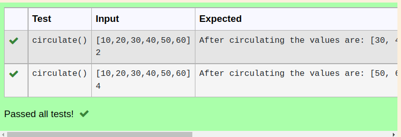

# Circulate-the-values-of-N-variables
## Aim:
To write a python program to circulate the n variables using function concept
## Equipment’s required:
PC
Anaconda - Python 3.7
## Algorithm: 
### Step 1: 
first step is to define the function
### Step 2: 
get a,n inputs from the user
### Step 3: 
define the formula
### Step 4: 
Get the value from the user for the number of rotation
### Step 5:
Using the slicing concept rotate the list
### Step 6:
print the result

## Program:
```python
#Program to circulate N values.
#Developed by: S.E.Elamaran
#RegisterNumber:22000420
def circulate():
    a=eval(input())
    n=int(input())
    a=a[n: ]+a[ :n]
    print('After circulating the values are:',a)
```    


## Output:


## Result:
By this program we able to circulate the values of n - variables
